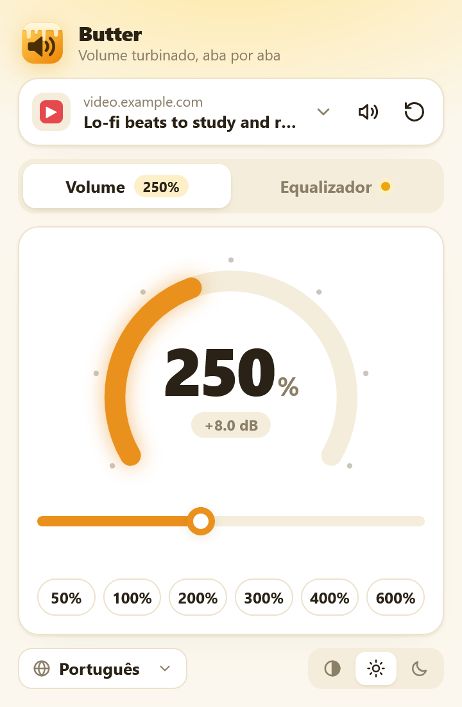
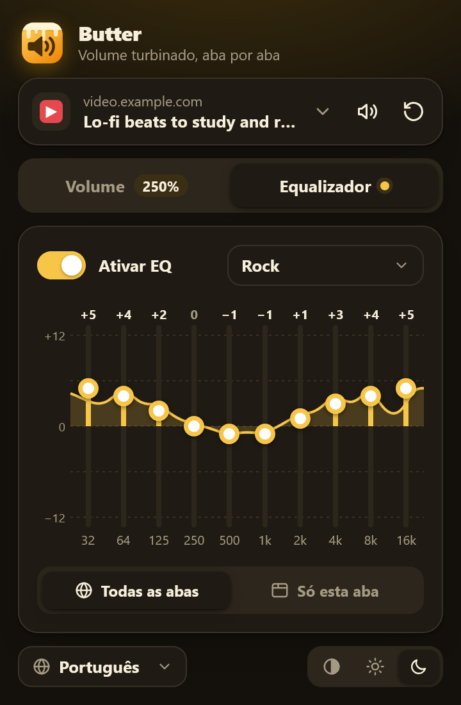
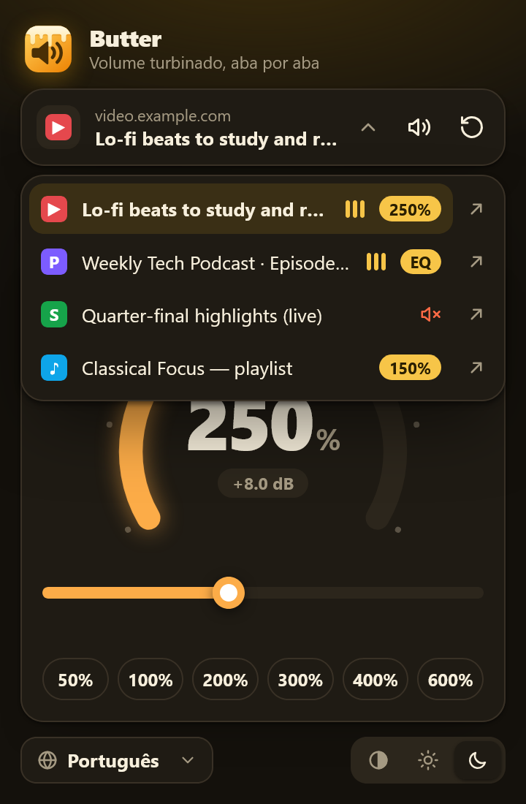
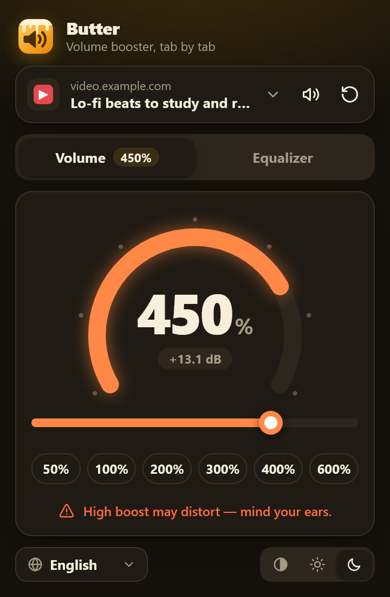
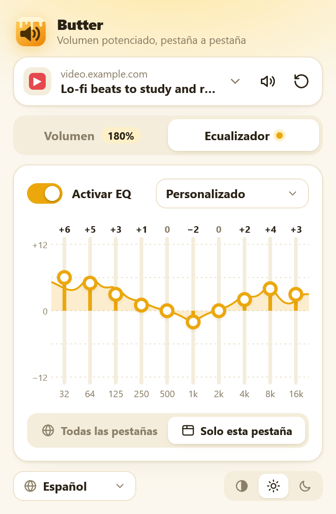

<p align="center"></p>

<h1 align="center">Butter — Tab Volume Booster</h1>

<p align="center">
  A Firefox extension that boosts the volume of <b>specific tabs</b> up to <b>600%</b> and shapes their sound with a <b>10‑band equalizer</b>.<br>
  English · Português · Español — light, dark and automatic themes.
</p>

<p align="center">
  
  
  
</p>

## Features

- **Per-tab boost from 0% to 600%**: gauge, slider, quick presets and mouse wheel, plus a built-in limiter so heavy boosts get louder instead of clipping.
- **10-band equalizer** (32 Hz to 16 kHz, ±12 dB) with a live frequency-response curve and 10 presets (Bass boost, Vocal, Rock, Electronic…).
- **Global or per-tab EQ**: the global EQ is saved and applies to every tab. Any tab can switch to its own EQ, which overrides the global one while the tab is open.
- **Manage every tab with audio** from one popup: see which tabs are playing, boosted or muted, control any of them, or jump to it.
- **Badge on the toolbar icon** shows each tab's boost.
- A tab's volume follows it across navigations until it's closed.
- **PT / EN / ES**: follows the browser language, or pick one manually.
- **Light, dark and automatic theme.**
- No data collection, no remote code, no dependencies, no build step.

<details>
<summary>More screenshots</summary>
<p>
  
  
</p>
</details>

## Install (from source)

1. Clone this repository.
2. Open `about:debugging#/runtime/this-firefox` in Firefox (140 or newer).
3. Click **Load Temporary Add-on…** and pick `manifest.json`.

Or run it in a fresh profile with [web-ext](https://github.com/mozilla/web-ext): `npx web-ext run`. To build the package for addons.mozilla.org, run `npx web-ext build`; the `.xpi` lands in `web-ext-artifacts/`.

## How it works

A content script routes the page's `<audio>`/`<video>` elements through Web Audio:

```
media element → 10 × BiquadFilter (EQ) → Gain (boost) → DynamicsCompressor (limiter) → speakers
```

It only touches a page's media once you change something for that tab, so tabs at their defaults are left alone.

## Limitations

- **DRM-protected media** (Netflix, Spotify…) and **cross-origin media served without CORS** can't be processed. Firefox would turn them silent, so Butter leaves them at normal volume.
- Firefox doesn't allow extensions on `about:` pages, addons.mozilla.org or Reader View.
- Sound generated directly with a page's own Web Audio (some games), media inside shadow DOM and media elements not attached to the page aren't boosted.

## Development

```bash
node scripts/check.mjs        # JS syntax + every i18n key present in every locale
node scripts/test-audio.mjs   # audio graph test in headless Firefox (silent)
node scripts/screenshots.mjs  # re-render docs/*.png with headless Firefox
```

## Português 🇧🇷

Extensão para Firefox que aumenta o volume de **abas específicas** até **600%**, com **equalizador de 10 bandas** (global e salvo, ou próprio de cada aba), curva de resposta em tempo real, presets, limitador contra distorção e controle de todas as abas com áudio pelo mesmo menu. Interface em português, inglês e espanhol, com tema claro, escuro ou automático. Para instalar, abra `about:debugging#/runtime/this-firefox`, clique em **Carregar extensão temporária…** e selecione o `manifest.json`.

## License

[MIT](LICENSE)
